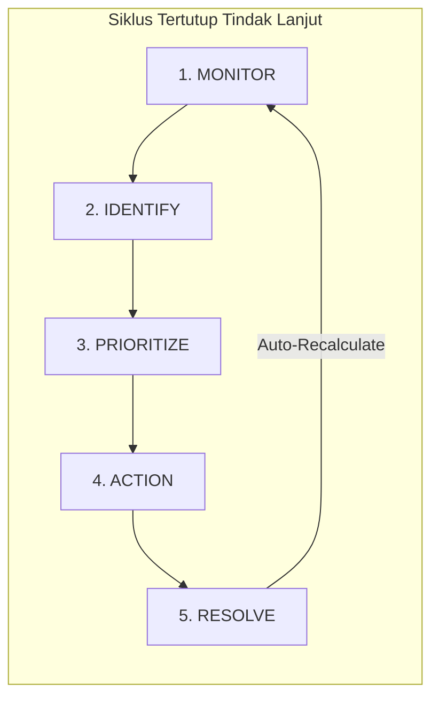
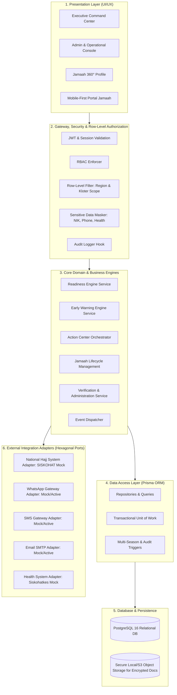
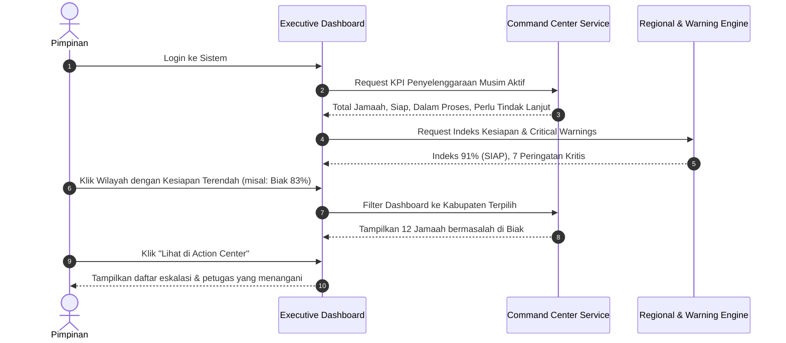
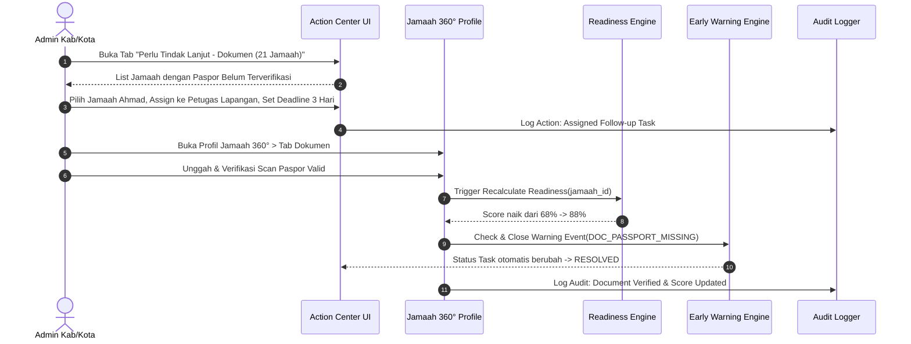
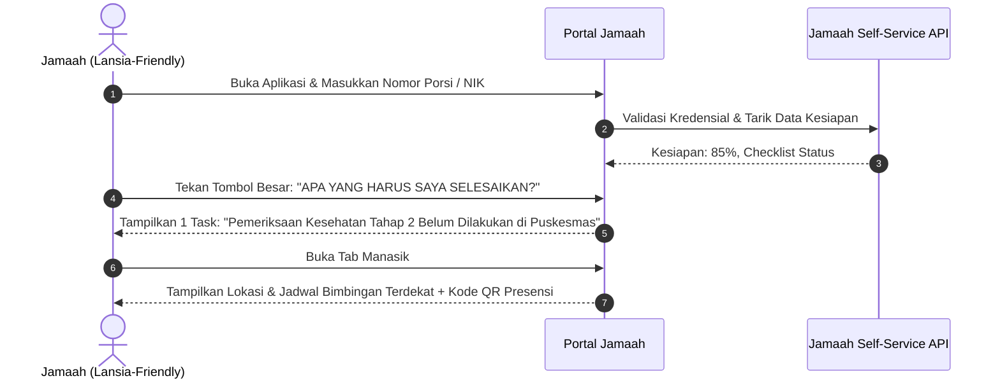
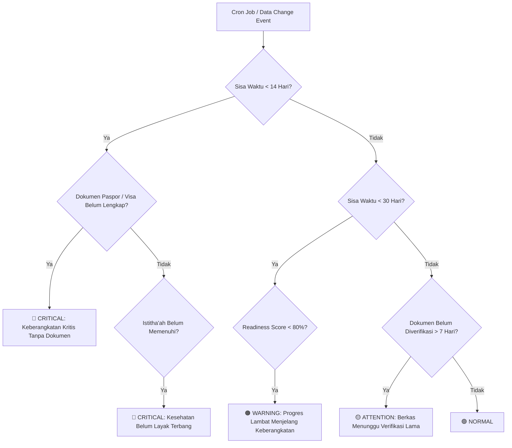
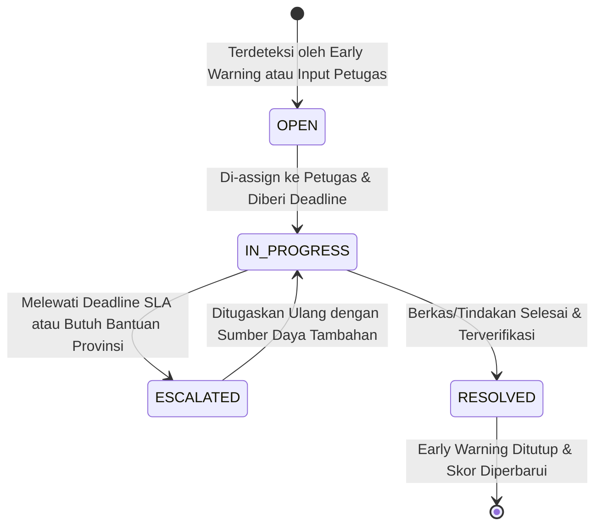
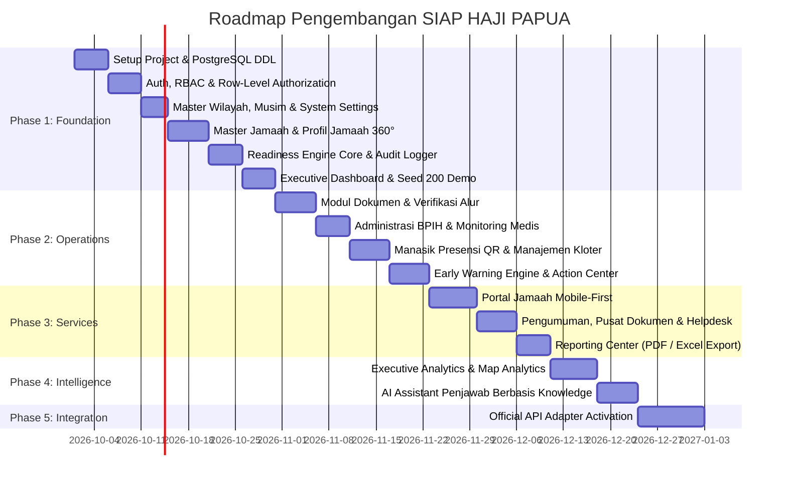

# SYSTEM DESIGN DOCUMENT (SDD)
## SIAP HAJI PAPUA v1.0
**Sistem Informasi Administrasi, Monitoring, dan Pelayanan Haji Provinsi Papua**
*Satu Data • Satu Monitoring • Satu Layanan • Haji Papua Siap*

---

## 1. EXECUTIVE SYSTEM CONCEPT

### 1.1 Visi & Tujuan Strategis
**SIAP HAJI PAPUA** dirancang sebagai **Provincial Hajj Monitoring, Coordination & Service Command Center**. Sistem ini bukan sekadar aplikasi pencatatan database jamaah (CRUD registry biasa), melainkan instrumen komando dan operasional terintegrasi untuk:
1. Memberikan visibilitas instan kepada pimpinan dan pengambil kebijakan terkait kondisi penyelenggaraan ibadah haji di seluruh wilayah Provinsi Papua.
2. Mengotomasi deteksi dini masalah (bottlenecks) administrasi, dokumen, pemeriksaan kesehatan, manasik, dan pengelompokan kloter melalui rule engine cerdas.
3. Mengubah data pasif menjadi tindakan terukur melalui alur kerja **MONITOR → IDENTIFY → PRIORITIZE → ACTION → RESOLVE**.
4. Memberikan layanan mandiri yang sederhana, transparan, dan aksesibel kepada jamaah (mobile-first, ramah lansia) serta memfasilitasi komunikasi dua arah via helpdesk dan pengumuman terarah.

### 1.2 Hirarki Penyelenggaraan Sistem
Sistem mengadopsi struktur vertikal berjenjang dengan pembatasan hak akses berbasis wilayah dan unit penugasan (*Row-Level Authorization*):
```
PROVINSI PAPUA (Pimpinan & Admin Komando Provinsi)
       ↓
KABUPATEN / KOTA (Admin Wilayah & Kemenag Kab/Kota)
       ↓
KELOMPOK / KLOTER / PETUGAS (Ketua Kloter, Karom, Karu, TPHD, TKHI)
       ↓
JAMAAH (Akses Mandiri Data Personal & Status Kesiapan)
```

### 1.3 Siklus Operasional Inti (Core Product Principle)

- **MONITOR**: Command Center menyajikan data real-time indikator kesiapan jamaah per kabupaten/kota dan kloter.
- **IDENTIFY**: Early Warning Engine mendeteksi anomali (misal: 21 paspor belum diverifikasi < 30 hari keberangkatan).
- **PRIORITIZE**: Action Center mengelompokkan masalah berdasarkan tingkat keparahan (*Critical*, *Warning*, *Attention*).
- **ACTION**: Penugasan spesifik kepada petugas kabupaten/kloter, penambahan catatan, dan penentuan tenggat waktu (*deadline*).
- **RESOLVE**: Petugas menyelesaikan berkas/administrasi, memverifikasi dokumen, dan sistem secara otomatis memperbarui *Readiness Score* serta menutup peringatan.

### 1.4 Prinsip Agnostik Lembaga & Nol Hard-Coding
Sistem memisahkan secara tegas antara logika bisnis aplikasi dengan identitas kelembagaan. Seluruh atribut berikut tersimpan di database konfigurasi (*system_settings* & master tables):
- Nama instansi pengelola (Kanwil Kemenag / Badan Penyelenggara Haji / Lembaga Terkait).
- Logo aplikasi, logo instansi, favicon, dan identitas visual.
- Nomenklatur wilayah administratif (dapat disesuaikan jika terjadi pemekaran wilayah otonomi baru).
- Musim haji aktif (Tahun Hijriah & Masehi).
- Bobot komponen readiness dan ambang batas peringatan (*warning thresholds*).

---

## 2. PROPOSED TECHNOLOGY STACK

Pilihan teknologi dirancang untuk performa tinggi, keamanan data pemerintahan berstandar enterprise, skalabilitas, dan kemudahan pemeliharaan:

| Lapisan (Layer) | Teknologi Terpilih | Justifikasi Teknis & Relevansi |
| :--- | :--- | :--- |
| **Frontend Framework** | **Next.js 15 (App Router, React 19, TypeScript)** | Server-Side Rendering (SSR) untuk load time kilat, Server Actions untuk mutasi aman, SEO internal, serta arsitektur berbasis komponen modular. |
| **Styling & Design Tokens** | **Tailwind CSS v4 + Radix UI Primitives** | Sistem token warna custom (Deep Emerald, Warm Gold, Charcoal), utilitas responsif, animasi minimalis, dan kepatuhan aksesibilitas tinggi (ARIA). |
| **State & Data Fetching** | **TanStack Query (React Query) + Zustand** | Caching data server-state yang efisien, optimasi optimistic update pada Action Center, dan state global terisolasi (filter, drawer, active season). |
| **Tabel & Visualisasi Data** | **TanStack Table v8 + Recharts + Leaflet.js** | Virtualized high-performance data table untuk ratusan jamaah, grafik performa kesiapan, dan peta interaktif wilayah Papua (GeoJSON/TopoJSON). |
| **Backend & API Layer** | **Next.js Modular Route Handlers / Service Layer** | Arsitektur modular *ports-and-adapters* dengan validasi runtime skema ketat menggunakan **Zod**. |
| **Database Engine** | **PostgreSQL 16+** | Relational integrity ketat, dukungan JSONB untuk metadata dinamis, UUID v4/v7 native, indexing komposit, andal untuk transaksi konkuren. |
| **ORM / Query Builder** | **Prisma ORM** | Type-safe query generation, skema migrasi deklaratif, seed management, dan perlindungan otomatis terhadap SQL Injection. |
| **Otentikasi & Keamanan** | **NextAuth.js / Jose JWT + Argon2** | Cookie HTTP-Only dengan flag Secure & SameSite, hashing kata sandi kuat (Argon2id), session rotation, dan audit trail sesi. |
| **Security & Masking** | **AES-256-GCM + RBAC/RLAC Engine** | Enkripsi field-level untuk data sensitif di rest, middleware penyamaran (masking) NIK dan No HP otomatis berdasarkan hak akses. |
| **Background Processing** | **Modular In-Memory / Redis Task Worker** | Antrean komputasi background untuk kalkulasi massal Readiness Engine dan evaluasi aturan Early Warning tanpa memblokir thread HTTP. |

---

## 3. SYSTEM ARCHITECTURE

Sistem mengadopsi pola **Clean Hexagonal Architecture (Ports and Adapters)** untuk memastikan keterpisahan antara *Core Domain Engine* dengan lapisan *Presentation*, *Database*, dan *External Integrations*.



### Klasifikasi Data & Metadata Sumber Data
Setiap record entitas utama (Jamaah, Dokumen, Administrasi, Pemeriksaan Kesehatan) wajib menyimpan atribut klasifikasi:
- `DEMO`: Data sintetis untuk keperluan simulasi dan pengujian sistem.
- `INTERNAL`: Data inputan langsung dari petugas kabupaten/kota atau provinsi Papua.
- `VERIFIED`: Data internal yang telah divalidasi dokumen fisik atau faktualnya oleh verifikator berwenang.
- `OFFICIAL EXTERNAL`: Data yang diperoleh langsung melalui koneksi API resmi dari sistem kementerian/nasional.

---

## 4. SITEMAP & NAVIGASI SISTEM

```
SIAP HAJI PAPUA
│
├── [PUBLIC / AUTH]
│   ├── /login (Login terintegrasi dengan deteksi role otomatis)
│   ├── /forgot-password
│   └── /verify-otp (Fondasi MFA Akun Administratif)
│
├── [COMMAND CENTER - Pimpinan & Admin Provinsi]
│   ├── /dashboard (Executive Command Center)
│   ├── /monitoring/wilayah (Ranking & Detail Kesiapan Kabupaten/Kota)
│   ├── /monitoring/peta (Peta Analitik Sebaran & Kesiapan Jamaah Papua)
│   ├── /monitoring/early-warning (Pusat Peringatan Dini Multi-Kategori)
│   └── /action-center (Pusat Eskalasi & Tindak Lanjut Masalah)
│
├── [OPERASIONAL - Admin Provinsi, Admin Kab/Kota, Petugas]
│   ├── /jamaah (Master Data Jamaah, Filter Multi-Kriteria, Ekspor)
│   │   └── /jamaah/[id] (Profil Komprehensif Jamaah 360°)
│   ├── /dokumen (Monitoring & Verifikasi Berkas Paspor, Visa, KTP, dll.)
│   ├── /administrasi (Monitoring Status Pendaftaran, BPIH, SPPH, Pelunasan)
│   ├── /kesehatan (Monitoring Administratif Status Istitha'ah & Tahapan Pemeriksaan)
│   ├── /manasik (Jadwal Bimbingan, Materi, Rekap Kehadiran, QR Presensi)
│   ├── /kloter (Manajemen Kloter, Penempatan Regu/Rombongan, Manifest Internal)
│   │   └── /kloter/[id] (Kloter Command Center)
│   ├── /perjalanan (Monitoring Tahapan Perjalanan: Asrama, Embarkasi, Saudi, Debarkasi)
│   └── /kalender (Kalender Haji Terpadu Tingkat Provinsi & Wilayah)
│
├── [LAYANAN - Terbuka untuk Seluruh Role & Jamaah]
│   ├── /pengumuman (Pemberitahuan Terarah Berdasarkan Wilayah/Kloter)
│   ├── /pusat-informasi (Knowledge Base Panduan, Syarat, Alur, Edukasi Haji)
│   ├── /pusat-dokumen (Repositori Regulasi, SOP, Edaran, Formulir Resmi)
│   ├── /helpdesk (Pengaduan & Tiket Layanan Jamaah)
│   └── /notifikasi (Pusat Notifikasi Real-time & Riwayat Alert)
│
├── [PORTAL JAMAAH - Akses Khusus Jamaah (Mobile-First)]
│   ├── /portal (Beranda Kesiapan Personal & Skor Indeks)
│   ├── /portal/tasks (Daftar Aksi: "Apa yang Harus Saya Selesaikan?")
│   ├── /portal/dokumen (Status & Unggah Dokumen Mandiri)
│   ├── /portal/manasik (Jadwal & Kartu QR Presensi Bimbingan)
│   ├── /portal/kloter (Informasi Kloter, Regu, Rombongan & Petugas Pendamping)
│   ├── /portal/bantuan (Buat Tiket Pengaduan & Bantuan Cepat)
│   └── /portal/profil (Data Pribadi & Toggle Mode Teks Besar)
│
├── [INSIGHT & INTELLIGENCE - Pimpinan & Super Admin]
│   ├── /analytics (Analitik Tren Kesiapan, Demografi, Proyeksi Waktu)
│   ├── /laporan (Pusat Cetak & Ekspor Rekapitulasi PDF / Excel)
│   └── /ai-assistant (Asisten Cerdas Penjawab Berbasis Knowledge Base)
│
└── [SYSTEM ADMINISTRATION - Super Admin]
    ├── /system/users (Manajemen Akun, Reset Password, Status Aktif)
    ├── /system/roles (Konfigurasi RBAC & Hak Akses Fitur)
    ├── /system/master-data (Master Wilayah, Musim Haji, Embarkasi, Dokumen)
    ├── /system/readiness-config (Bobot Komponen & Threshold Kategori)
    ├── /system/warning-rules (Konfigurasi Logika Aturan Early Warning)
    ├── /system/integrations (Status Adapter Eksternal & Mode Mock/Active)
    ├── /system/settings (Identitas Instansi, Logo, Footer, Branding)
    └── /system/audit-log (Jejak Rekam Mutasi & Akses Data Sensitif)
```

---

## 5. ROLE & PERMISSION MATRIX (RBAC + ROW-LEVEL AUTHORIZATION)

### 5.1 Definisi Role Sistem
1. **Super Admin Provinsi (`SUPER_ADMIN`)**: Kontrol penuh terhadap pengaturan sistem, user, peran, master data, konfigurasi engine, audit log, dan integrasi.
2. **Pimpinan (`EXECUTIVE`)**: Akses pemantauan eksekutif read-only lintas wilayah; melihat KPI, indeks kesiapan, statistik, kloter, peta sebaran, dan tren.
3. **Admin Provinsi (`PROV_ADMIN`)**: Operasional pemantauan menyeluruh, verifikasi eskalasi, manajemen kloter antar wilayah, tindak lanjut Action Center provinsi.
4. **Admin Kabupaten/Kota (`REGION_ADMIN`)**: Operasional terbatas hanya pada wilayah kerjanya (*Row-Level Authorization* berbasis `region_id`).
5. **Petugas / Kloter (`OFFICER`)**: Memantau daftar jamaah pada kloter yang ditugaskan (*Row-Level Authorization* berbasis `kloter_id`).
6. **Jamaah (`JAMAAH`)**: Hanya dapat mengakses data pribadi miliknya sendiri (*Row-Level Authorization* berbasis `jamaah_id`).

### 5.2 Matriks Hak Akses (Permission Matrix)

| Modul / Kemampuan | Super Admin | Pimpinan | Admin Provinsi | Admin Kab/Kota | Petugas Kloter | Jamaah |
| :--- | :---: | :---: | :---: | :---: | :---: | :---: |
| **Executive Dashboard & Peta** | Full | View Only | View Only | Scoped (Wilayah) | Scoped (Kloter) | No |
| **Master Data Jamaah (Lihat Data)** | Full | View (Masked) | Full (Prov) | Scoped (Wilayah) | Scoped (Kloter) | Self Only |
| **Lihat NIK / Data Medis Sensitif** | Full | No | Full | Scoped (Wilayah) | Emergency Only | Self Only |
| **Tambah / Edit Jamaah** | Full | No | Full | Scoped (Wilayah) | No | Limited (Profil) |
| **Verifikasi Dokumen Paspor/Visa** | Full | No | Full | Scoped (Wilayah) | View Status | Self Upload |
| **Update Status Administrasi** | Full | No | Full | Scoped (Wilayah) | No | View Status |
| **Monitoring Kesehatan (Admin)** | Full | Agregat | Full | Scoped (Wilayah) | Scoped Status | View Status |
| **Kelola Manasik & Presensi QR** | Full | Agregat | Full | Scoped (Wilayah) | Catat Presensi | Show QR |
| **Manajemen Kloter & Manifest** | Full | Agregat | Full | Scoped View | Scoped View | Scoped View |
| **Action Center (Assign/Resolve)** | Full | View Only | Full (Prov) | Scoped (Wilayah) | Scoped (Kloter) | No |
| **Helpdesk & Pengaduan** | Full | View Strategic| Full | Scoped (Wilayah) | Scoped (Kloter) | Create / View Own|
| **Cetak & Ekspor Laporan (PDF/XLS)**| Full | View / PDF | Full | Scoped (Wilayah) | Scoped (Kloter) | Bukti Porsi PDF |
| **Konfigurasi Bobot Readiness** | Full | No | No | No | No | No |
| **Konfigurasi Early Warning Rules**| Full | No | No | No | No | No |
| **System Settings & Branding** | Full | No | No | No | No | No |
| **Akses Audit Trail** | Full | View Summary | View | No | No | No |

---

## 6. USER FLOW

### 6.1 Alur Pimpinan (Executive Monitoring Flow)


### 6.2 Alur Petugas: Tindak Lanjut Masalah Dokumen (Monitor to Resolve)


### 6.3 Alur Jamaah (Mobile-First Self-Service)


---

## 7. ENTITY RELATIONSHIP DIAGRAM (ERD)

```mermaid
erDiagram
    SYSTEM_SETTINGS ||--o{ AUDIT_LOGS : records
    HAJJ_SEASONS ||--o{ JAMAAH : registers
    HAJJ_SEASONS ||--o{ KLOTER : organizes
    HAJJ_SEASONS ||--o{ READINESS_SCORES : calculates
    REGIONS ||--o{ JAMAAH : resides_in
    REGIONS ||--o{ USERS : assigned_to
    REGIONS ||--o{ MANASIK_EVENTS : hosts

    USERS ||--o{ USER_ROLES : has
    ROLES ||--o{ USER_ROLES : grants
    ROLES ||--o{ ROLE_PERMISSIONS : defines
    PERMISSIONS ||--o{ ROLE_PERMISSIONS : contains
    USERS ||--o{ AUDIT_LOGS : triggers
    USERS ||--o{ ACTION_ITEMS : assigned_to

    JAMAAH ||--o{ JAMAAH_CONTACTS : includes
    JAMAAH ||--o{ JAMAAH_STATUS_HISTORY : transitions
    JAMAAH ||--o{ JAMAAH_DOCUMENTS : owns
    JAMAAH ||--o{ ADMINISTRATION_RECORDS : holds
    JAMAAH ||--o{ HEALTH_MONITORING : records
    JAMAAH ||--o{ MANASIK_ATTENDANCE : attends
    JAMAAH ||--o{ KLOTER_MEMBERS : grouped_in
    JAMAAH ||--o{ READINESS_SCORES : achieves
    JAMAAH ||--o{ WARNING_EVENTS : flags
    JAMAAH ||--o{ ACTION_ITEMS : targets
    JAMAAH ||--o{ HELPDESK_TICKETS : creates

    DOCUMENT_TYPES ||--o{ JAMAAH_DOCUMENTS : categorizes
    JAMAAH_DOCUMENTS ||--o{ DOCUMENT_VERIFICATIONS : verified_by
    MANASIK_EVENTS ||--o{ MANASIK_ATTENDANCE : logs

    KLOTER ||--o{ KLOTER_MEMBERS : contains
    KLOTER ||--o{ OFFICERS : assigned
    KLOTER ||--o{ TRAVEL_SCHEDULES : scheduled

    READINESS_COMPONENTS ||--o{ READINESS_SCORES : weights
    WARNING_RULES ||--o{ WARNING_EVENTS : triggers
    WARNING_EVENTS ||--o{ ACTION_ITEMS : spawns

    HELPDESK_TICKETS ||--o{ TICKET_MESSAGES : threads
    HELPDESK_TICKETS ||--o{ TICKET_ASSIGNMENTS : delegates
    ANNOUNCEMENTS ||--o{ ANNOUNCEMENT_TARGETS : broadcasts
```



---

## 8. DATABASE SCHEMA (POSTGRESQL DDL)

Semua entitas dirancang menggunakan PostgreSQL modern dengan UUID v4, relasi foreign key berintegritas tinggi, *soft-delete* (`deleted_at`), dan indeks komposit untuk optimasi query agregat Command Center.

```sql
-- EKSTENSI POSTGRESQL
CREATE EXTENSION IF NOT EXISTS "uuid-ossp";
CREATE EXTENSION IF NOT EXISTS "pgcrypto";

-- 1. PENGATURAN SISTEM (CONFIGURABLE SYSTEM SETTINGS)
CREATE TABLE system_settings (
    id UUID PRIMARY KEY DEFAULT gen_random_uuid(),
    setting_key VARCHAR(100) UNIQUE NOT NULL,
    setting_value TEXT NOT NULL,
    setting_group VARCHAR(50) NOT NULL DEFAULT 'GENERAL', -- GENERAL, BRANDING, SECURITY, HAJJ
    description TEXT,
    is_public BOOLEAN NOT NULL DEFAULT FALSE,
    updated_at TIMESTAMP WITH TIME ZONE DEFAULT CURRENT_TIMESTAMP,
    updated_by UUID
);

-- 2. MASTER WILAYAH (REGIONS) - AGNOSTIK HIERARKI PAPUA
CREATE TABLE regions (
    id UUID PRIMARY KEY DEFAULT gen_random_uuid(),
    code VARCHAR(20) UNIQUE NOT NULL, -- e.g., REG-JPR-KOTA, REG-BIAK
    name VARCHAR(150) NOT NULL, -- Kota Jayapura, Kab. Biak Numfor, dll.
    type VARCHAR(30) NOT NULL DEFAULT 'KABUPATEN', -- PROVINSI, KOTA, KABUPATEN
    parent_id UUID REFERENCES regions(id) ON DELETE SET NULL,
    latitude DECIMAL(10, 8),
    longitude DECIMAL(11, 8),
    is_active BOOLEAN NOT NULL DEFAULT TRUE,
    created_at TIMESTAMP WITH TIME ZONE DEFAULT CURRENT_TIMESTAMP,
    updated_at TIMESTAMP WITH TIME ZONE DEFAULT CURRENT_TIMESTAMP
);
CREATE INDEX idx_regions_code ON regions(code);

-- 3. MUSIM HAJI (HAJJ SEASONS)
CREATE TABLE hajj_seasons (
    id UUID PRIMARY KEY DEFAULT gen_random_uuid(),
    year_hijri INT NOT NULL, -- e.g., 1447
    year_gregorian INT NOT NULL, -- e.g., 2026
    season_name VARCHAR(100) NOT NULL, -- Musim Haji 1447H / 2026M
    quota_total INT NOT NULL DEFAULT 0,
    quota_regular INT NOT NULL DEFAULT 0,
    quota_reserved INT NOT NULL DEFAULT 0,
    departure_start_date DATE,
    return_end_date DATE,
    is_active BOOLEAN NOT NULL DEFAULT FALSE,
    created_at TIMESTAMP WITH TIME ZONE DEFAULT CURRENT_TIMESTAMP,
    updated_at TIMESTAMP WITH TIME ZONE DEFAULT CURRENT_TIMESTAMP
);
CREATE UNIQUE INDEX idx_hajj_seasons_active ON hajj_seasons(is_active) WHERE is_active = TRUE;

-- 4. MANAJEMEN PENGGUNA & RBAC
CREATE TABLE users (
    id UUID PRIMARY KEY DEFAULT gen_random_uuid(),
    username VARCHAR(100) UNIQUE NOT NULL,
    email VARCHAR(150) UNIQUE NOT NULL,
    password_hash VARCHAR(255) NOT NULL,
    full_name VARCHAR(200) NOT NULL,
    phone_number VARCHAR(50),
    region_id UUID REFERENCES regions(id) ON DELETE SET NULL,
    avatar_url TEXT,
    is_active BOOLEAN NOT NULL DEFAULT TRUE,
    is_mfa_enabled BOOLEAN NOT NULL DEFAULT FALSE,
    mfa_secret_encrypted TEXT,
    last_login_at TIMESTAMP WITH TIME ZONE,
    failed_login_attempts INT NOT NULL DEFAULT 0,
    lockout_until TIMESTAMP WITH TIME ZONE,
    created_at TIMESTAMP WITH TIME ZONE DEFAULT CURRENT_TIMESTAMP,
    updated_at TIMESTAMP WITH TIME ZONE DEFAULT CURRENT_TIMESTAMP,
    deleted_at TIMESTAMP WITH TIME ZONE
);
CREATE INDEX idx_users_region ON users(region_id);

CREATE TABLE roles (
    id UUID PRIMARY KEY DEFAULT gen_random_uuid(),
    code VARCHAR(50) UNIQUE NOT NULL, -- SUPER_ADMIN, EXECUTIVE, PROV_ADMIN, REGION_ADMIN, OFFICER, JAMAAH
    name VARCHAR(100) NOT NULL,
    description TEXT,
    is_system_role BOOLEAN NOT NULL DEFAULT TRUE
);

CREATE TABLE permissions (
    id UUID PRIMARY KEY DEFAULT gen_random_uuid(),
    code VARCHAR(100) UNIQUE NOT NULL, -- e.g., jamaah:read, jamaah:write, document:verify
    module VARCHAR(50) NOT NULL, -- JAMAAH, DOCUMENT, ACTION_CENTER, SYSTEM
    description TEXT
);

CREATE TABLE user_roles (
    user_id UUID REFERENCES users(id) ON DELETE CASCADE,
    role_id UUID REFERENCES roles(id) ON DELETE CASCADE,
    PRIMARY KEY (user_id, role_id)
);

CREATE TABLE role_permissions (
    role_id UUID REFERENCES roles(id) ON DELETE CASCADE,
    permission_id UUID REFERENCES permissions(id) ON DELETE CASCADE,
    PRIMARY KEY (role_id, permission_id)
);

-- 5. MASTER & DATA UTAMA JAMAAH
CREATE TABLE jamaah (
    id UUID PRIMARY KEY DEFAULT gen_random_uuid(),
    user_id UUID UNIQUE REFERENCES users(id) ON DELETE SET NULL, -- jika terhubung akun login jamaah
    season_id UUID NOT NULL REFERENCES hajj_seasons(id) ON DELETE RESTRICT,
    region_id UUID NOT NULL REFERENCES regions(id) ON DELETE RESTRICT,
    porsi_number VARCHAR(20) UNIQUE NOT NULL, -- Nomor Porsi 10 Digit
    nik_encrypted TEXT NOT NULL, -- Terenkripsi AES-256-GCM
    nik_hash VARCHAR(64) NOT NULL, -- SHA-256 untuk indexing pencarian tanpa dekripsi
    kk_number_encrypted TEXT,
    full_name VARCHAR(255) NOT NULL,
    birth_place VARCHAR(100) NOT NULL,
    birth_date DATE NOT NULL,
    gender VARCHAR(10) NOT NULL CHECK (gender IN ('MALE', 'FEMALE')),
    marital_status VARCHAR(20) DEFAULT 'MARRIED',
    address TEXT NOT NULL,
    district VARCHAR(100), -- Kecamatan
    sub_district VARCHAR(100), -- Kelurahan
    postal_code VARCHAR(10),
    phone_encrypted TEXT,
    blood_type VARCHAR(5),
    occupation VARCHAR(100),
    registration_year INT NOT NULL,
    estimated_departure_year INT,
    status VARCHAR(50) NOT NULL DEFAULT 'TERDAFTAR', -- TERDAFTAR, BERKAS_LENGKAP, SIAP_BERANGKAT, TUNDA, WAFAT
    data_source VARCHAR(30) NOT NULL DEFAULT 'INTERNAL', -- DEMO, INTERNAL, VERIFIED, OFFICIAL_EXTERNAL
    is_priority_elderly BOOLEAN NOT NULL DEFAULT FALSE,
    elderly_age INT,
    created_at TIMESTAMP WITH TIME ZONE DEFAULT CURRENT_TIMESTAMP,
    updated_at TIMESTAMP WITH TIME ZONE DEFAULT CURRENT_TIMESTAMP,
    deleted_at TIMESTAMP WITH TIME ZONE
);
CREATE INDEX idx_jamaah_season_region ON jamaah(season_id, region_id);
CREATE INDEX idx_jamaah_porsi ON jamaah(porsi_number);
CREATE INDEX idx_jamaah_nik_hash ON jamaah(nik_hash);
CREATE INDEX idx_jamaah_status ON jamaah(status);

CREATE TABLE jamaah_contacts (
    id UUID PRIMARY KEY DEFAULT gen_random_uuid(),
    jamaah_id UUID NOT NULL REFERENCES jamaah(id) ON DELETE CASCADE,
    contact_name VARCHAR(200) NOT NULL,
    relationship VARCHAR(50) NOT NULL, -- SUAMI, ISTRI, ANAK, SAUDARA
    phone_encrypted TEXT NOT NULL,
    address TEXT,
    is_emergency_contact BOOLEAN NOT NULL DEFAULT TRUE
);

CREATE TABLE jamaah_status_history (
    id UUID PRIMARY KEY DEFAULT gen_random_uuid(),
    jamaah_id UUID NOT NULL REFERENCES jamaah(id) ON DELETE CASCADE,
    previous_status VARCHAR(50),
    new_status VARCHAR(50) NOT NULL,
    change_reason TEXT,
    changed_by UUID REFERENCES users(id) ON DELETE SET NULL,
    created_at TIMESTAMP WITH TIME ZONE DEFAULT CURRENT_TIMESTAMP
);

-- 6. DOKUMEN & VERIFIKASI
CREATE TABLE document_types (
    id UUID PRIMARY KEY DEFAULT gen_random_uuid(),
    code VARCHAR(50) UNIQUE NOT NULL, -- PASPOR, VISA, KTP, KK, BUKU_NIKAH, FOTO, VAKSIN_MENINGITIS
    name VARCHAR(150) NOT NULL,
    is_required BOOLEAN NOT NULL DEFAULT TRUE,
    max_file_size_mb INT NOT NULL DEFAULT 5,
    allowed_extensions VARCHAR(100) NOT NULL DEFAULT 'pdf,jpg,jpeg,png',
    validation_regex TEXT,
    sort_order INT NOT NULL DEFAULT 0
);

CREATE TABLE jamaah_documents (
    id UUID PRIMARY KEY DEFAULT gen_random_uuid(),
    jamaah_id UUID NOT NULL REFERENCES jamaah(id) ON DELETE CASCADE,
    document_type_id UUID NOT NULL REFERENCES document_types(id) ON DELETE RESTRICT,
    file_path TEXT,
    file_size_bytes BIGINT,
    mime_type VARCHAR(100),
    document_number VARCHAR(100), -- misal: Nomor Paspor
    issued_date DATE,
    expiry_date DATE,
    status VARCHAR(30) NOT NULL DEFAULT 'BELUM_ADA', -- BELUM_ADA, UPLOADED, MENUNGGU_VERIFIKASI, TERVERIFIKASI, DITOLAK
    rejection_reason TEXT,
    data_source VARCHAR(30) NOT NULL DEFAULT 'INTERNAL',
    uploaded_at TIMESTAMP WITH TIME ZONE,
    uploaded_by UUID REFERENCES users(id) ON DELETE SET NULL,
    created_at TIMESTAMP WITH TIME ZONE DEFAULT CURRENT_TIMESTAMP,
    updated_at TIMESTAMP WITH TIME ZONE DEFAULT CURRENT_TIMESTAMP,
    CONSTRAINT uq_jamaah_doc UNIQUE (jamaah_id, document_type_id)
);
CREATE INDEX idx_jamaah_doc_status ON jamaah_documents(status);

CREATE TABLE document_verifications (
    id UUID PRIMARY KEY DEFAULT gen_random_uuid(),
    jamaah_document_id UUID NOT NULL REFERENCES jamaah_documents(id) ON DELETE CASCADE,
    action VARCHAR(20) NOT NULL CHECK (action IN ('VERIFY', 'REJECT', 'NEED_REVISION')),
    notes TEXT,
    verified_by UUID NOT NULL REFERENCES users(id) ON DELETE RESTRICT,
    created_at TIMESTAMP WITH TIME ZONE DEFAULT CURRENT_TIMESTAMP
);

-- 7. ADMINISTRASI & KEUANGAN (MONITORING ADMINISTRATIF)
CREATE TABLE administration_records (
    id UUID PRIMARY KEY DEFAULT gen_random_uuid(),
    jamaah_id UUID NOT NULL REFERENCES jamaah(id) ON DELETE CASCADE,
    stage_name VARCHAR(100) NOT NULL, -- SETORAN_AWAL, PELUNASAN_BPIH, SPPH, BIOMETRIK_BIOVISA
    amount_paid DECIMAL(15, 2) DEFAULT 0.00,
    payment_reference VARCHAR(100),
    status VARCHAR(30) NOT NULL DEFAULT 'BELUM', -- BELUM, DALAM_PROSES, MENUNGGU_VERIFIKASI, SELESAI, PERLU_TINDAK_LANJUT
    completion_date DATE,
    notes TEXT,
    data_source VARCHAR(30) NOT NULL DEFAULT 'INTERNAL',
    verified_by UUID REFERENCES users(id) ON DELETE SET NULL,
    created_at TIMESTAMP WITH TIME ZONE DEFAULT CURRENT_TIMESTAMP,
    updated_at TIMESTAMP WITH TIME ZONE DEFAULT CURRENT_TIMESTAMP,
    CONSTRAINT uq_jamaah_admin_stage UNIQUE (jamaah_id, stage_name)
);

-- 8. MONITORING KESEHATAN (ADMINISTRATIF & NON-MEDIS UNTUK PRIVASI)
CREATE TABLE health_monitoring (
    id UUID PRIMARY KEY DEFAULT gen_random_uuid(),
    jamaah_id UUID NOT NULL REFERENCES jamaah(id) ON DELETE CASCADE,
    checkup_stage VARCHAR(50) NOT NULL, -- TAHAP_1_PUSKESMAS, TAHAP_2_RSUD, TAHAP_3_EMBARKASI
    examination_date DATE,
    location_name VARCHAR(150),
    istithaah_status VARCHAR(50) DEFAULT 'BELUM_PEMERIKSAAN', -- MEMENUHI_SYARAT, MEMENUHI_DENGAN_PENDAMPING, TIDAK_MEMENUHI, DITUNDA
    is_vaccine_meningitis BOOLEAN NOT NULL DEFAULT FALSE,
    is_vaccine_polio BOOLEAN NOT NULL DEFAULT FALSE,
    is_vaccine_covid BOOLEAN NOT NULL DEFAULT FALSE,
    administrative_status VARCHAR(30) NOT NULL DEFAULT 'BELUM', -- BELUM, PROSES, SELESAI, PERLU_TINDAK_LANJUT
    notes_non_medical TEXT, -- Catatan administratif (bebas diagnosis klinis)
    medical_encrypted_data TEXT, -- Catatan sensitif khusus dokter berizin
    data_source VARCHAR(30) NOT NULL DEFAULT 'INTERNAL',
    created_at TIMESTAMP WITH TIME ZONE DEFAULT CURRENT_TIMESTAMP,
    updated_at TIMESTAMP WITH TIME ZONE DEFAULT CURRENT_TIMESTAMP,
    CONSTRAINT uq_jamaah_health_stage UNIQUE (jamaah_id, checkup_stage)
);

-- 9. MANAJEMEN MANASIK & PRESENSI QR
CREATE TABLE manasik_events (
    id UUID PRIMARY KEY DEFAULT gen_random_uuid(),
    season_id UUID NOT NULL REFERENCES hajj_seasons(id) ON DELETE RESTRICT,
    region_id UUID NOT NULL REFERENCES regions(id) ON DELETE RESTRICT,
    title VARCHAR(200) NOT NULL,
    session_number INT NOT NULL DEFAULT 1,
    event_date DATE NOT NULL,
    start_time TIME NOT NULL,
    end_time TIME NOT NULL,
    location VARCHAR(200) NOT NULL,
    speaker_name VARCHAR(150),
    topic_description TEXT,
    qr_secret_token VARCHAR(100) NOT NULL DEFAULT encode(gen_random_bytes(32), 'hex'),
    is_active BOOLEAN NOT NULL DEFAULT TRUE,
    created_at TIMESTAMP WITH TIME ZONE DEFAULT CURRENT_TIMESTAMP,
    updated_at TIMESTAMP WITH TIME ZONE DEFAULT CURRENT_TIMESTAMP
);

CREATE TABLE manasik_attendance (
    id UUID PRIMARY KEY DEFAULT gen_random_uuid(),
    event_id UUID NOT NULL REFERENCES manasik_events(id) ON DELETE CASCADE,
    jamaah_id UUID NOT NULL REFERENCES jamaah(id) ON DELETE CASCADE,
    status VARCHAR(20) NOT NULL DEFAULT 'HADIR' CHECK (status IN ('HADIR', 'TIDAK_HADIR', 'IZIN', 'SAKIT')),
    check_in_time TIMESTAMP WITH TIME ZONE DEFAULT CURRENT_TIMESTAMP,
    attendance_method VARCHAR(20) NOT NULL DEFAULT 'QR_SCAN', -- QR_SCAN, MANUAL_OPERATOR
    verified_by UUID REFERENCES users(id) ON DELETE SET NULL,
    CONSTRAINT uq_manasik_jamaah UNIQUE (event_id, jamaah_id)
);

-- 10. KELOMPOK, KLOTER & PETUGAS
CREATE TABLE kloter (
    id UUID PRIMARY KEY DEFAULT gen_random_uuid(),
    season_id UUID NOT NULL REFERENCES hajj_seasons(id) ON DELETE RESTRICT,
    kloter_number INT NOT NULL, -- e.g., 1, 2, 3...
    kloter_code VARCHAR(50) UNIQUE NOT NULL, -- e.g., UPG-01, JPR-01
    embarkation_name VARCHAR(100) NOT NULL DEFAULT 'EMBARKASI MAKASSAR (UPG)',
    dormitory_in_date TIMESTAMP WITH TIME ZONE,
    flight_departure_date TIMESTAMP WITH TIME ZONE,
    flight_return_date TIMESTAMP WITH TIME ZONE,
    airline_name VARCHAR(100) DEFAULT 'Garuda Indonesia',
    flight_number VARCHAR(50),
    capacity_total INT NOT NULL DEFAULT 360,
    status VARCHAR(30) NOT NULL DEFAULT 'DRAFT', -- DRAFT, AKTIF, DI_ASRAMA, BERANGKAT, DI_SAUDI, PULANG, SELESAI
    created_at TIMESTAMP WITH TIME ZONE DEFAULT CURRENT_TIMESTAMP,
    updated_at TIMESTAMP WITH TIME ZONE DEFAULT CURRENT_TIMESTAMP
);

CREATE TABLE groups (
    id UUID PRIMARY KEY DEFAULT gen_random_uuid(),
    kloter_id UUID NOT NULL REFERENCES kloter(id) ON DELETE CASCADE,
    group_type VARCHAR(20) NOT NULL CHECK (group_type IN ('ROMBONGAN', 'REGU')),
    group_number INT NOT NULL,
    name VARCHAR(100) NOT NULL,
    leader_jamaah_id UUID REFERENCES jamaah(id) ON DELETE SET NULL
);

CREATE TABLE kloter_members (
    id UUID PRIMARY KEY DEFAULT gen_random_uuid(),
    kloter_id UUID NOT NULL REFERENCES kloter(id) ON DELETE RESTRICT,
    group_id UUID REFERENCES groups(id) ON DELETE SET NULL,
    jamaah_id UUID UNIQUE NOT NULL REFERENCES jamaah(id) ON DELETE RESTRICT,
    seat_number VARCHAR(10),
    assigned_at TIMESTAMP WITH TIME ZONE DEFAULT CURRENT_TIMESTAMP
);

CREATE TABLE officers (
    id UUID PRIMARY KEY DEFAULT gen_random_uuid(),
    season_id UUID NOT NULL REFERENCES hajj_seasons(id) ON DELETE RESTRICT,
    kloter_id UUID REFERENCES kloter(id) ON DELETE SET NULL,
    user_id UUID REFERENCES users(id) ON DELETE SET NULL,
    full_name VARCHAR(200) NOT NULL,
    role_type VARCHAR(50) NOT NULL, -- TPHI (Ketua Kloter), TPIHI (Bimbingan Ibadah), TKHI (Dokter/Perawat), TPHD
    phone_encrypted TEXT NOT NULL,
    status VARCHAR(30) NOT NULL DEFAULT 'ACTIVE'
);

-- 11. READINESS ENGINE CONFIGURATION & SCORES
CREATE TABLE readiness_components (
    id UUID PRIMARY KEY DEFAULT gen_random_uuid(),
    component_code VARCHAR(50) UNIQUE NOT NULL, -- IDENTITAS, ADMINISTRASI, DOKUMEN, KESEHATAN, MANASIK, KLOTER
    name VARCHAR(100) NOT NULL,
    weight_percentage DECIMAL(5, 2) NOT NULL, -- Default: 10, 20, 20, 20, 15, 15 (Total: 100)
    evaluation_logic VARCHAR(100) NOT NULL, -- Rule Evaluator Handler Name
    is_active BOOLEAN NOT NULL DEFAULT TRUE,
    sort_order INT NOT NULL DEFAULT 0
);

CREATE TABLE readiness_scores (
    id UUID PRIMARY KEY DEFAULT gen_random_uuid(),
    jamaah_id UUID UNIQUE NOT NULL REFERENCES jamaah(id) ON DELETE CASCADE,
    season_id UUID NOT NULL REFERENCES hajj_seasons(id) ON DELETE RESTRICT,
    total_score DECIMAL(5, 2) NOT NULL DEFAULT 0.00, -- 0.00 to 100.00
    category VARCHAR(30) NOT NULL DEFAULT 'PRIORITAS', -- SIAP (>=90), HAMPIR_SIAP (75-89), PERLU_TINDAK_LANJUT (50-74), PRIORITAS (<50)
    component_breakdown JSONB NOT NULL DEFAULT '{}'::jsonb, -- Detail poin per komponen
    last_calculated_at TIMESTAMP WITH TIME ZONE DEFAULT CURRENT_TIMESTAMP
);
CREATE INDEX idx_readiness_score ON readiness_scores(total_score);
CREATE INDEX idx_readiness_category ON readiness_scores(category);

-- 12. EARLY WARNING ENGINE RULES & EVENTS
CREATE TABLE warning_rules (
    id UUID PRIMARY KEY DEFAULT gen_random_uuid(),
    rule_code VARCHAR(50) UNIQUE NOT NULL,
    name VARCHAR(150) NOT NULL,
    severity VARCHAR(20) NOT NULL CHECK (severity IN ('CRITICAL', 'WARNING', 'ATTENTION', 'NORMAL')),
    condition_expression JSONB NOT NULL, -- Logical AST e.g. {"days_to_departure": {"lt": 14}, "doc_status": "incomplete"}
    description TEXT,
    is_active BOOLEAN NOT NULL DEFAULT TRUE
);

CREATE TABLE warning_events (
    id UUID PRIMARY KEY DEFAULT gen_random_uuid(),
    rule_id UUID NOT NULL REFERENCES warning_rules(id) ON DELETE RESTRICT,
    jamaah_id UUID NOT NULL REFERENCES jamaah(id) ON DELETE CASCADE,
    region_id UUID NOT NULL REFERENCES regions(id) ON DELETE RESTRICT,
    severity VARCHAR(20) NOT NULL,
    title VARCHAR(200) NOT NULL,
    reason TEXT NOT NULL,
    status VARCHAR(20) NOT NULL DEFAULT 'OPEN' CHECK (status IN ('OPEN', 'IN_PROGRESS', 'RESOLVED', 'IGNORED')),
    detected_at TIMESTAMP WITH TIME ZONE DEFAULT CURRENT_TIMESTAMP,
    resolved_at TIMESTAMP WITH TIME ZONE,
    resolved_by UUID REFERENCES users(id) ON DELETE SET NULL,
    resolution_notes TEXT
);
CREATE INDEX idx_warning_status ON warning_events(status, severity);
CREATE INDEX idx_warning_jamaah ON warning_events(jamaah_id);

-- 13. ACTION CENTER (PUSAT TINDAK LANJUT)
CREATE TABLE action_items (
    id UUID PRIMARY KEY DEFAULT gen_random_uuid(),
    warning_event_id UUID REFERENCES warning_events(id) ON DELETE SET NULL,
    jamaah_id UUID NOT NULL REFERENCES jamaah(id) ON DELETE CASCADE,
    category VARCHAR(50) NOT NULL, -- DOKUMEN, PEMERIKSAAN, ADMINISTRASI, MANASIK, KLOTER, VERIFIKASI
    title VARCHAR(255) NOT NULL,
    description TEXT,
    assigned_to_user_id UUID REFERENCES users(id) ON DELETE SET NULL,
    assigned_by_user_id UUID REFERENCES users(id) ON DELETE SET NULL,
    deadline DATE,
    status VARCHAR(20) NOT NULL DEFAULT 'OPEN' CHECK (status IN ('OPEN', 'IN_PROGRESS', 'ESCALATED', 'RESOLVED')),
    priority VARCHAR(20) NOT NULL DEFAULT 'HIGH', -- URGENT, HIGH, MEDIUM, LOW
    notes TEXT,
    created_at TIMESTAMP WITH TIME ZONE DEFAULT CURRENT_TIMESTAMP,
    updated_at TIMESTAMP WITH TIME ZONE DEFAULT CURRENT_TIMESTAMP,
    resolved_at TIMESTAMP WITH TIME ZONE
);
CREATE INDEX idx_action_items_status ON action_items(status);
CREATE INDEX idx_action_items_assigned ON action_items(assigned_to_user_id);

-- 14. LAYANAN, PENGUMUMAN & HELPDESK
CREATE TABLE announcements (
    id UUID PRIMARY KEY DEFAULT gen_random_uuid(),
    title VARCHAR(255) NOT NULL,
    content TEXT NOT NULL,
    category VARCHAR(50) NOT NULL DEFAULT 'PENTING', -- PENTING, DOKUMEN, MANASIK, PEMERIKSAAN, KEBERANGKATAN, INFORMASI
    attachment_url TEXT,
    is_published BOOLEAN NOT NULL DEFAULT TRUE,
    published_at TIMESTAMP WITH TIME ZONE DEFAULT CURRENT_TIMESTAMP,
    created_by UUID REFERENCES users(id) ON DELETE SET NULL
);

CREATE TABLE announcement_targets (
    id UUID PRIMARY KEY DEFAULT gen_random_uuid(),
    announcement_id UUID NOT NULL REFERENCES announcements(id) ON DELETE CASCADE,
    target_type VARCHAR(30) NOT NULL DEFAULT 'ALL', -- ALL, REGION, KLOTER, SPECIFIC_JAMAAH
    target_id UUID -- Menyimpan region_id, kloter_id, atau jamaah_id
);

CREATE TABLE helpdesk_tickets (
    id UUID PRIMARY KEY DEFAULT gen_random_uuid(),
    ticket_number VARCHAR(30) UNIQUE NOT NULL, -- TIKET-2026-0001
    jamaah_id UUID REFERENCES jamaah(id) ON DELETE SET NULL,
    category VARCHAR(50) NOT NULL, -- DOKUMEN, KESEHATAN, MANASIK, KLOTER, BANTUAN_UMUM
    subject VARCHAR(200) NOT NULL,
    status VARCHAR(20) NOT NULL DEFAULT 'OPEN' CHECK (status IN ('OPEN', 'ASSIGNED', 'IN_PROGRESS', 'RESOLVED', 'CLOSED')),
    sla_due_date TIMESTAMP WITH TIME ZONE,
    created_at TIMESTAMP WITH TIME ZONE DEFAULT CURRENT_TIMESTAMP,
    updated_at TIMESTAMP WITH TIME ZONE DEFAULT CURRENT_TIMESTAMP
);

CREATE TABLE ticket_messages (
    id UUID PRIMARY KEY DEFAULT gen_random_uuid(),
    ticket_id UUID NOT NULL REFERENCES helpdesk_tickets(id) ON DELETE CASCADE,
    sender_user_id UUID REFERENCES users(id) ON DELETE SET NULL,
    message TEXT NOT NULL,
    attachment_url TEXT,
    created_at TIMESTAMP WITH TIME ZONE DEFAULT CURRENT_TIMESTAMP
);

-- 15. AUDIT TRAIL IMMUTABLE (LOG AUDIT SISTEM)
CREATE TABLE audit_logs (
    id UUID PRIMARY KEY DEFAULT gen_random_uuid(),
    actor_id UUID REFERENCES users(id) ON DELETE SET NULL,
    actor_username VARCHAR(100),
    actor_role VARCHAR(50),
    ip_address VARCHAR(45),
    user_agent TEXT,
    action VARCHAR(50) NOT NULL, -- LOGIN, LOGOUT, VIEW_SENSITIVE, CREATE, UPDATE, DELETE, VERIFY, EXPORT
    module VARCHAR(50) NOT NULL, -- JAMAAH, DOKUMEN, HEALTH, ACTION_CENTER, SETTINGS
    record_id VARCHAR(100),
    before_state JSONB,
    after_state JSONB,
    created_at TIMESTAMP WITH TIME ZONE DEFAULT CURRENT_TIMESTAMP
);
CREATE INDEX idx_audit_logs_actor ON audit_logs(actor_id);
CREATE INDEX idx_audit_logs_created ON audit_logs(created_at);
```

---

## 9. API ARCHITECTURE & ENDPOINT DESIGN

API mengadopsi standar RESTful dengan respons seragam dan enkapsulasi otorisasi berbasis middleware:

### Format Respons Standar
```json
{
  "success": true,
  "code": 200,
  "message": "Data berhasil diambil",
  "data": { ... },
  "meta": {
    "page": 1,
    "pageSize": 25,
    "totalRecords": 350,
    "activeSeason": "1447H / 2026M",
    "dataClassification": "INTERNAL"
  }
}
```

### Katalog Endpoint Inti
| Method | Endpoint Path | Akses Minimal | Deskripsi Fungsi |
| :--- | :--- | :--- | :--- |
| `POST` | `/api/v1/auth/login` | Public | Otentikasi username/email & password, mengembalikan HTTP-Only Session Cookie |
| `POST` | `/api/v1/auth/logout` | Authenticated | Revokasi sesi dan pencatatan audit log keluar |
| `GET` | `/api/v1/dashboard/executive` | `EXECUTIVE` | Agregasi KPI real-time provinsi, skor kesiapan, dan ringkasan warning |
| `GET` | `/api/v1/dashboard/regional-readiness`| `EXECUTIVE` | Data tabel ranking kesiapan seluruh kabupaten/kota Papua |
| `GET` | `/api/v1/dashboard/map-analytics` | `EXECUTIVE` | GeoJSON poligon & titik agregat jamaah Papua per kabupaten/kota |
| `GET` | `/api/v1/jamaah` | `REGION_ADMIN` | List jamaah dengan filter, sorting, pagination, dan auto-masking NIK |
| `GET` | `/api/v1/jamaah/:id/360` | `REGION_ADMIN` | Data profil 360° lengkap (Overview, Dokumen, Medis, Manasik, Timeline) |
| `POST` | `/api/v1/jamaah/:id/documents` | `REGION_ADMIN` | Unggah berkas dokumen jamaah ke penyimpanan terenkripsi |
| `PATCH`| `/api/v1/documents/:id/verify` | `PROV_ADMIN` | Aksi verifikasi atau penolakan dokumen + auto-recalc readiness |
| `GET` | `/api/v1/action-center/items` | `OFFICER` | Mengambil daftar masalah operasional berdasarkan status dan prioritas |
| `PATCH`| `/api/v1/action-center/items/:id` | `REGION_ADMIN` | Assign petugas, perpanjang deadline, atau tutup eskalasi (*Resolve*) |
| `GET` | `/api/v1/kloter` | `OFFICER` | Daftar kloter, persentase kesiapan, kapasitas, dan jadwal penerbangan |
| `GET` | `/api/v1/portal/me` | `JAMAAH` | Beranda portal mandiri jamaah (skor kesiapan, checklist, identitas) |
| `GET` | `/api/v1/portal/outstanding-tasks` | `JAMAAH` | Daftar actionable tasks spesifik untuk diselesaikan oleh jamaah |
| `POST` | `/api/v1/portal/tickets` | `JAMAAH` | Pembuatan tiket bantuan atau pengaduan mandiri oleh jamaah |
| `GET` | `/api/v1/system/settings` | `SUPER_ADMIN` | Konfigurasi dinamis identitas instansi, logo, dan preferensi aplikasi |
| `PATCH`| `/api/v1/system/readiness-config`| `SUPER_ADMIN` | Penyesuaian bobot komponen readiness (wajib total valid 100%) |

---

## 10. READINESS ENGINE LOGIC

Readiness Engine adalah **Core Intelligence Engine** yang menghitung kesiapan setiap jamaah secara objektif dan deterministik tanpa hard-coding bobot.

### 10.1 Formula Matematika Komputasi
$$\text{ReadinessScore}(J) = \sum_{i=1}^{n} \left( \frac{\text{ProgressComponent}_i(J)}{\text{TargetComponent}_i} \times \text{WeightComponent}_i \right)$$

Dengan batasan wajib:
$$\sum_{i=1}^{n} \text{WeightComponent}_i = 100.00\%$$

### 10.2 Komponen Default & Aturan Evaluasi
| Komponen | Bobot Default | Aturan Evaluasi Progres (0.0 – 1.0) |
| :--- | :---: | :--- |
| **Identitas & Biodata** | **10%** | NIK valid (0.3) + KK lengkap (0.3) + Alamat & Kontak Keluarga valid (0.4) |
| **Administrasi & Keuangan** | **20%** | Setoran Awal Lunas (0.4) + Pelunasan BPIH Selesai (0.4) + SPPH Terverifikasi (0.2) |
| **Dokumen Wajib** | **20%** | Paspor Terverifikasi (0.4) + Visa Siap (0.3) + Buku Nikah/Akta (0.2) + Pasfoto (0.1) |
| **Pemeriksaan Kesehatan** | **20%** | Tahap 1 Puskesmas (0.25) + Tahap 2 RSUD (0.25) + Vaksin Meningitis (0.25) + Status Istitha'ah Memenuhi (0.25) |
| **Bimbingan Manasik** | **15%** | Persentase kehadiran manasik: $\min(1.0, \frac{\text{Total Hadir}}{\text{Minimal Sesi Wajib}})$ |
| **Penempatan Kloter** | **15%** | Kloter Ditugaskan (0.5) + Rombongan/Regu Ditugaskan (0.3) + Seat Number Terkonfirmasi (0.2) |
| **TOTAL** | **100%** | **Rentang Skor Akhir: 0.00 – 100.00** |

### 10.3 Kategori Kesiapan & Ambang Batas (Configurable Thresholds)
- **90.00 – 100.00** : **SIAP** (Warna: Hijau Emerald `#15803D`) — Jamaah telah melengkapi seluruh tahapan utama.
- **75.00 – 89.99** : **HAMPIR SIAP** (Warna: Biru `#2563EB`) — Tersisa sedikit item sekunder (misal penempatan seat atau 1 sesi manasik).
- **50.00 – 74.99** : **PERLU TINDAK LANJUT** (Warna: Amber Kuning `#D97706`) — Terdapat hambatan dokumen atau pemeriksaan yang memerlukan intervensi.
- **< 50.00** : **PRIORITAS** (Warna: Merah `#DC2626`) — Berisiko gagal berangkat jika tidak ditindaklanjuti segera.

### 10.4 Mekanisme Recalculation Otomatis
Sistem menggunakan *Event-Driven Pattern*:
1. Setiap kali terjadi event: `DOCUMENT_VERIFIED`, `DOCUMENT_REJECTED`, `HEALTH_STATUS_UPDATED`, `MANASIK_ATTENDED`, atau `KLOTER_ASSIGNED`.
2. Engine langsung mengeksekusi fungsi kalkulasi ulang untuk `jamaah_id` terkait.
3. Nilai skor baru disimpan ke tabel `readiness_scores`.
4. Dilakukan evaluasi apakah ada *Early Warning* yang perlu di-trigger atau ditutup.

---

## 11. EARLY WARNING ENGINE LOGIC

Early Warning Engine bekerja secara proaktif mendeteksi potensi risiko kegagalan keberangkatan jamaah.

### 11.1 Matriks Aturan Standar (Rule Evaluation Matrix)


### 11.2 Spesifikasi Aturan Default
1. **CRITICAL (`🔴`)**:
   - Aturan: `departure_date - CURRENT_DATE <= 14` DAN `(paspor_status != 'TERVERIFIKASI' OR visa_status != 'TERVERIFIKASI')`.
   - Tindakan: Sistem otomatis membuat tiket di Action Center dengan prioritas **URGENT** dan notifikasi blast ke Admin Provinsi & Kab/Kota.
2. **WARNING (`🟠`)**:
   - Aturan: `departure_date - CURRENT_DATE <= 30` DAN `readiness_score < 80.00`.
   - Tindakan: Menandai jamaah dalam daftar prioritas wilayah untuk penugasan petugas pendamping.
3. **ATTENTION (`🟡`)**:
   - Aturan: Dokumen diunggah jamaah tetapi belum diverifikasi oleh petugas selama `> 7 hari kerja`.
   - Tindakan: Mengirim pengingat internal ke dashboard verifikator kabupaten terkait.
4. **NORMAL (`🟢`)**:
   - Seluruh tahapan sesuai jadwal dan readiness score berada dalam kategori aman.

---

## 12. ACTION CENTER WORKFLOW

Action Center adalah realisasi operasional dari prinsip **MONITOR → IDENTIFY → PRIORITIZE → ACTION → RESOLVE**.



### Tahapan Operasional:
1. **Tampilan Angka Terpilah**: Dashboard menampilkan kartu rekapitulasi, misalnya:
   - `⚠ 21 Jamaah — Dokumen`
   - `⚠ 17 Jamaah — Pemeriksaan Kesehatan`
   - `⚠ 19 Jamaah — Administrasi BPIH`
   - `⚠ 8 Jamaah — Manasik Tertinggal`
2. **Drill-down Filter**: Klik pada kartu membuka daftar jamaah spesifik dengan alasan masalah yang terperinci.
3. **Penugasan (Delegation)**: Admin dapat memilih banyak jamaah (*bulk assign*) atau perorangan kepada petugas lapangan dengan tenggat waktu (*deadline*).
4. **Penyelesaian Otomatis (Auto-Resolution)**: Ketika dokumen yang dipersyaratkan berhasil diverifikasi, status Action Item otomatis bertransisi ke `RESOLVED` tanpa perlu konfirmasi manual berulang.

---

## 13. SECURITY, PRIVACY & COMPLIANCE

### 13.1 Enkripsi & Proteksi Data Pribadi (UU PDP Compliant)
- **Field-Level Encryption (AES-256-GCM)**: NIK, Nomor KK, Nomor HP, dan Data Medis Sensitif dienkripsi sebelum disimpan di database PostgreSQL. Kunci enkripsi dikelola melalui environment variable terisolasi.
- **Pencarian Tanpa Dekripsi (Blind Indexing)**: Menggunakan hash satu arah (HMAC-SHA256) untuk kolom NIK sehingga pencarian cepat tetap dapat dilakukan tanpa mendekripsi seluruh database.
- **Penyamaran Data Otomatis (Data Masking)**:
  - NIK pada tampilan umum disamarkan: `917101******0003`.
  - Nomor Handphone disamarkan: `0812-****-4589`.
  - Hanya role `SUPER_ADMIN`, `PROV_ADMIN`, dan `REGION_ADMIN` (pada wilayahnya) yang memiliki otorisasi membuka masking dengan catatan audit trail.

### 13.2 Segregasi Data Medis (Medical Data Isolation)
- Data pemeriksaan klinis tidak boleh tampil pada dashboard umum.
- Dashboard dan tabel hanya menampilkan status administratif: `MEMENUHI_SYARAT`, `MEMENUHI_DENGAN_PENDAMPING`, `TIDAK_MEMENUHI`, atau `DITUNDA`.

### 13.3 Audit Trail yang Tidak Dapat Dimanipulasi (Immutable Audit Log)
- Setiap transaksi penting dicatat: login/logout, penayangan data sensitif (unmasking), verifikasi/penolakan dokumen, perubahan role/permission, dan ekspor data laporan.
- Tabel audit log diberi proteksi ketat (tidak menyediakan fitur hapus atau sunting melalui antarmuka apa pun).

---

## 14. WIREFRAME: EXECUTIVE COMMAND CENTER (PIMPINAN)

```
+--------------------------------------------------------------------------------------------------+
| [LOGO] SIAP HAJI PAPUA          Command Center Penyelenggaraan Haji Papua         [1447 H / 2026 M]|
| Wilayah: Seluruh Provinsi Papua                                                  Petugas: Pimpinan|
+--------------------------------------------------------------------------------------------------+
| [ KPI UTAMA REAL-TIME ]                                                                          |
| +-----------------+ +-----------------+ +-----------------+ +-----------------+ +----------------+ |
| | TOTAL JAMAAH    | | SIAP BERANGKAT  | | DALAM PROSES    | | TINDAK LANJUT   | | TOTAL KLOTER   | |
| | 1.080 Jamaah    | | 892 (82.5%)     | | 145 (13.4%)     | | 43 (4.1%) ⚠     | | 4 Kloter       | |
| +-----------------+ +-----------------+ +-----------------+ +-----------------+ +----------------+ |
+--------------------------------------------------------------------------------------------------+
| [ INDEKS KESIAPAN HAJI PROVINSI PAPUA ]                                                          |
| SKOR KESIAPAN: 91.4% [STATUS: SIAP]                                                              |
| [████████████████████████████████████████████████████████████████████░░░░░░░] 91.4%             |
| Identitas: 99% | Administrasi: 95% | Dokumen: 88% | Kesehatan: 86% | Manasik: 92% | Kloter: 88%    |
+--------------------------------------------------------------------------------------------------+
| [ EARLY WARNING ALERT SYSTEM ]                                                                   |
| [🔴 7 CRITICAL - Keberangkatan <14 Hari, Paspor/Visa Belum Terbit] -> [Lihat Tindak Lanjut]     |
| [🟠 18 WARNING  - Keberangkatan <30 Hari, Kesiapan <80%]            -> [Lihat Tindak Lanjut]     |
| [🟡 31 ATTENTION - Dokumen Menunggu Verifikasi >5 Hari]              -> [Lihat Tindak Lanjut]     |
+----------------------------------------------------------------+---------------------------------+
| [ KESIAPAN PER KABUPATEN / KOTA ]                              | [ PETA SEBARAN JAMAAH PAPUA ]   |
| 1. Kota Jayapura    [████████████████████░░] 97% (340 Jamaah)  |      ^ (Peta Interaktif)        |
| 2. Kab. Jayapura    [██████████████████░░░] 94% (180 Jamaah)  |     / \   [Kota Jayapura: 340]  |
| 3. Kab. Keerom      [█████████████████░░░░] 91% (110 Jamaah)  |    /   \  [Merauke: 120]        |
| 4. Kab. Sarmi       [███████████████░░░░░░] 87% ( 75 Jamaah)  |   (_____) [Biak: 85]            |
| 5. Kab. Biak Numfor [██████████████░░░░░░░] 83% ( 85 Jamaah)⚠ |                                 |
+----------------------------------------------------------------+---------------------------------+
| [ ACTION CENTER - PUSAT PRIORITAS PENYELESAIAN ]                                                 |
| [ 21 Dokumen ] | [ 17 Pemeriksaan ] | [ 19 Administrasi ] | [ 8 Manasik ] | [ 5 Verifikasi Data] |
+--------------------------------------------------------------------------------------------------+
```

---

## 15. WIREFRAME: DASHBOARD KABUPATEN / KOTA

```
+--------------------------------------------------------------------------------------------------+
| SIAP HAJI PAPUA > DASHBOARD WILAYAH: KOTA JAYAPURA                              [Data: INTERNAL] |
+--------------------------------------------------------------------------------------------------+
| Total Kuota Wilayah: 340 Jamaah | Pria: 152 | Wanita: 188 | Lansia Prioritas: 42 Jamaah          |
| Indeks Kesiapan Wilayah: 97.2% [SIAP] [█████████████████████████████████████████░]               |
+--------------------------------------------------------------------------------------------------+
| RINGKASAN STATUS OPERASIONAL KOTA JAYAPURA                                                       |
| • Dokumen Lengkap    : 328 / 340 (96.5%)   • Pelunasan BPIH      : 340 / 340 (100%)              |
| • Istitha'ah Kesehatan: 322 / 340 (94.7%)   • Kehadiran Manasik   : 318 / 340 (93.5%)            |
+--------------------------------------------------------------------------------------------------+
| DAFTAR JAMAAH MEMBUTUHKAN TINDAK LANJUT CEPAT (PRIORITAS WILAYAH)                                |
| [Cari Nama / No Porsi...] [Filter Masalah: Semua v]                              [+ Tambah Task] |
| +----------------------------------------------------------------------------------------------+ |
| | No Porsi    | Nama Jamaah       | Usia | Kloter | Masalah / Kendala       | Status   | Aksi  | |
| +-------------+-------------------+------+--------+-------------------------+----------+-------+ |
| | 2700192831  | Hj. Aminah (L)    | 73 th| UPG-01 | Paspor Belum Terverifikasi| OPEN   | [Detail]|
| | 2700192845  | Bpk. Burhanuddin  | 58 th| UPG-01 | Tes Lab Tahap 2 Tertunda | IN-PROG  | [Detail]|
| | 2700192902  | Ibu Siti Rahma    | 62 th| UPG-02 | Absen Manasik 3x        | ASSIGNED | [Detail]|
| +----------------------------------------------------------------------------------------------+ |
+--------------------------------------------------------------------------------------------------+
```

---

## 16. WIREFRAME: PROFIL JAMAAH 360°

```
+--------------------------------------------------------------------------------------------------+
| SIAP HAJI PAPUA > DATA JAMAAH > PROFIL 360°                                     [STATUS: INTERNAL]|
+--------------------------------------------------------------------------------------------------+
| [ FOTO ]  ACHMAD SUBARJO                                   Skor Kesiapan: 94.0% [SIAP]           |
|           No. Porsi : 2700198421                           [██████████████████████████░]         |
|           NIK       : 917101******0002 [Buka Masking]      Kloter: UPG-01 | Regu: 03 | Romb: 01  |
|           Wilayah   : Kota Jayapura                        Status: SIAP BERANGKAT                |
+--------------------------------------------------------------------------------------------------+
| [TABS]: [OVERVIEW] | [BIODATA] | [DOKUMEN] | [ADMINISTRASI] | [KESEHATAN] | [MANASIK] | [TIMELINE]   |
+--------------------------------------------------------------------------------------------------+
| TAB AKTIF: [DOKUMEN]                                                                             |
| +----------------------------------------------------------------------------------------------+ |
| | Jenis Dokumen   | Status          | No. Berkas     | Tanggal Upload | Verifikator | Tindakan | |
| +-----------------+-----------------+----------------+----------------+-------------+----------+ |
| | Paspor RI       | TERVERIFIKASI ✓ | B 8912341      | 12/08/2026     | Admin Prov  | [Lihat]  | |
| | Visa Haji       | TERVERIFIKASI ✓ | V-SA-2026-991  | 20/08/2026     | Kemenag RI  | [Lihat]  | |
| | Scan KTP & KK   | TERVERIFIKASI ✓ | 917101...      | 05/06/2026     | Admin Kota  | [Lihat]  | |
| | Vaksin Polio    | BELUM LENGKAP ⚠ | -              | -              | -           | [+Upload]| |
| +----------------------------------------------------------------------------------------------+ |
+--------------------------------------------------------------------------------------------------+
| TAB AKTIF: [TIMELINE PERJALANAN & EVENT]                                                         |
| • 24/08/2026 14:10 : Visa Haji berhasil diverifikasi oleh Admin Provinsi                         |
| • 20/08/2026 09:30 : Hadir Bimbingan Manasik Massal Sesi 4 (Presensi QR Berhasil)              |
| • 15/08/2026 11:00 : Hasil Pemeriksaan Kesehatan Tahap 2: Memenuhi Syarat Istitha'ah           |
| • 01/06/2026 10:00 : Pelunasan BPIH Bank Syariah Terkonfirmasi Lunas                            |
+--------------------------------------------------------------------------------------------------+
```

---

## 17. WIREFRAME: KLOTER COMMAND CENTER

```
+--------------------------------------------------------------------------------------------------+
| SIAP HAJI PAPUA > KLOTER COMMAND CENTER: KLOTER 01 (UPG-01)                     [Status: AKTIF]  |
+--------------------------------------------------------------------------------------------------+
| Embarkasi: Makassar (UPG)   | Total Jamaah: 360 / 360  | Ketua Kloter: Ust. Fathurrahman, Lc    |
| Maskapai : Garuda GA-1102   | Siap: 348 (96.7%)        | Dokter Kloter: dr. Siti Aminah, Sp.KO   |
| Masuk Asrama: 10 Mei 2026   | Belum Siap: 12 (3.3%)    | Kesiapan Kloter: 96.7% [SIAP]          |
| Jadwal Terbang: 11 Mei 2026 | Critical Alert: 0        | [███████████████████████████░]          |
+--------------------------------------------------------------------------------------------------+
| FILTER MANIFEST INTERNAL: [O Semua (360)] [O Siap (348)] [O Perlu Tindak Lanjut (12)] [Ekspor PDF]|
| +----------------------------------------------------------------------------------------------+ |
| | No Seat | No. Porsi    | Nama Lengkap      | Regu/Romb  | Dokumen | Kesehatan | Kesiapan | Aksi  | |
| +---------+--------------+-------------------+------------+---------+-----------+----------+-------+ |
| | 01-A    | 2700190101   | H. Syaiful Anwar  | Regu 1/R1  | Lengkap | Memenuhi  | 100%     | [Lihat] |
| | 01-B    | 2700190102   | Hj. Nur Halimah   | Regu 1/R1  | Lengkap | Memenuhi  | 100%     | [Lihat] |
| | 02-C    | 2700190244   | Bpk. Herman M.    | Regu 2/R1  | Paspor? | Memenuhi  | 74% ⚠    | [Action]|
| +----------------------------------------------------------------------------------------------+ |
+--------------------------------------------------------------------------------------------------+
```

---

## 18. WIREFRAME: PORTAL JAMAAH (MOBILE-FIRST)

Desain difokuskan pada kesederhanaan, teks kontras tinggi, navigasi yang intuitif untuk jamaah lanjut usia, serta dilengkapi tombol cepat **"Mode Teks Besar"**:

```
+------------------------------------------+
|  [LOGO] SIAP HAJI PAPUA     [Aa+ Teks]   |
+------------------------------------------+
|  Assalamu'alaikum,                       |
|  BAPAK AHMAD SUBARJO                     |
|  No. Porsi : 2700198421                  |
|  Kloter    : UPG-01 (Makassar)           |
+------------------------------------------+
|  STATUS KESIAPAN ANDA                    |
|  88% [HAMPIR SIAP]                       |
|  [██████████████████████████░░░░]        |
|                                          |
|  ✓ Biodata Jamaah                        |
|  ✓ Pelunasan BPIH                        |
|  ✓ Paspor & Visa Haji                    |
|  ⏳ Vaksinasi & Kesehatan Tahap 2        |
|  ✓ Bimbingan Manasik                     |
|  ✓ Penempatan Kloter                     |
+------------------------------------------+
|  +------------------------------------+  |
|  |       [ TOMBOL UTAMA BESAR ]       |  |
|  |   APA YANG HARUS SAYA SELESAIKAN?  |  |
|  |         (1 Tugas Tertunda)         |  |
|  +------------------------------------+  |
+------------------------------------------+
|  AGENDA TERDEKAT SAYA                    |
|  🗓 Manasik Massal Sesi 5                |
|  📍 Masjid Raya Baiturrahim Jayapura     |
|  ⏰ Sabtu, 28 Mei 2026 • 08:30 WIT       |
|  [ Tampilkan QR Presensi Saya ]          |
+------------------------------------------+
|  [NAVIGASI BAWAH: BERANDA | DOKUMEN | BANTUAN] |
+------------------------------------------+
```

---

## 19. UI DESIGN SYSTEM & DESIGN TOKENS

### 19.1 Filosofi Visual: "Papua × Haji × Digital Government"
- **Nuansa Papua**: Aksen siluet Pegunungan Jayawijaya yang anggun, sentuhan bulu Cenderawasih keemasan pada lencana status, ornamen geometris tifa/ukiran Papua secara subtil sebagai latar *watermark* kartu (*low opacity* < 5%).
- **Nuansa Haji & Nilai Sakral**: Warna hijau zamrud Islami (*Deep Emerald*), aksen kubah lengkung (*Islamic arch*), dan tipografi kokoh yang menghadirkan wibawa institusi pemerintah modern.

### 19.2 Palet Warna & Semantic Tokens
| Token Name | Nilai Hex | Penggunaan Utama |
| :--- | :--- | :--- |
| `--color-primary-dark` | `#0A3E2F` | **Deep Emerald**: Header utama, sidebar command center, navigasi atas |
| `--color-primary` | `#15803D` | **Emerald Green**: Status sukses, tombol utama, indikator siap berangkat |
| `--color-accent-gold` | `#D4AF37` | **Warm Gold**: Aksen premium, ikon lencana prioritas, border kartu aktif |
| `--color-bg-base` | `#F8FAF8` | **Warm Neutral**: Latar belakang aplikasi (lembut di mata pengguna lansia) |
| `--color-surface` | `#FFFFFF` | **Pure White**: Latar kartu, modal dialog, dan kontainer tabel data |
| `--color-text-main` | `#1F2937` | **Dark Charcoal**: Teks heading dan body (kontras tinggi memenuhi WCAG AAA) |
| `--color-text-muted` | `#64748B` | **Muted Slate**: Label metadata, keterangan pendukung, dan timestamp |
| `--color-status-danger`| `#DC2626` | **Crimson Red**: Status CRITICAL, dokumen ditolak, tombol darurat |
| `--color-status-warning`|`#F59E0B` | **Amber Orange**: Status WARNING, perhatian, tugas menunggu verifikasi |
| `--color-status-info` | `#2563EB` | **Cobalt Blue**: Pengumuman umum, informasi jadwal, panduan resmi |

### 19.3 Aksesibilitas Khusus Jamaah Usia Lanjut
- **Ukuran Sentuh (Touch Target)**: Seluruh tombol di portal jamaah memiliki tinggi minimum **48px** (melebihi standar minimum 44px WCAG).
- **Mode Teks Besar**: Toggle satu klik yang memperbesar seluruh skala tipografi dari basis 16px menjadi **20px** dengan *line-height* longgar.
- **Multimodal Status**: Status tidak pernah hanya ditandai dengan warna; selalu dipadukan dengan teks eksplisit dan ikon penjelas (misal: `[✓ TERVERIFIKASI]`, `[⚠ BELUM SELESAI]`).

---

## 20. DEVELOPMENT ROADMAP



---

## 21. ARCHITECTURE VALIDATION MATRIX

Untuk memastikan tidak ada modul yang terisolasi tanpa aliran data (*data flow integrity*), seluruh komponen sistem divalidasi silang pada tabel berikut:

| Dari Elemen | Ke Elemen | Jalur Validasi & Integritas | Status Verifikasi |
| :--- | :--- | :--- | :---: |
| **Role & Scope** | **Row-Level Auth** | `region_id` dan `kloter_id` difilter di query ORM setiap request data. | **VALID & KONSISTEN** |
| **User Flow** | **Database Schema** | Seluruh aksi tombol (assign, verify, resolve) memiliki tabel & foreign key penampung. | **VALID & KONSISTEN** |
| **Perubahan Berkas** | **Readiness Engine** | Event `DOCUMENT_VERIFIED` memicu kalkulasi ulang skor otomatis secara real-time. | **VALID & KONSISTEN** |
| **Readiness < 80%** | **Warning Engine** | Rule evaluator mendeteksi nilai skor dan mendistribusikan alert ke `warning_events`. | **VALID & KONSISTEN** |
| **Warning Event** | **Action Center** | Alert otomatis menggenerasi baris `action_items` yang siap ditugaskan ke petugas. | **VALID & KONSISTEN** |
| **Aksi Petugas** | **Audit Trail** | Mutasi data kritis otomatis mencatat `actor_id`, `ip_address`, `before`, dan `after`. | **VALID & KONSISTEN** |
| **System Settings** | **Agnostik Nama/Logo**| UI merender nama dinamis dari tabel `system_settings`, tidak ada hard-coded instansi.| **VALID & KONSISTEN** |

---

## 22. RISK IDENTIFICATION & MITIGATION

### 22.1 Asumsi Proyek (Assumptions)
1. **Infrastruktur Jaringan Papua**: Beberapa kabupaten di wilayah pedalaman/pegunungan mungkin mengalami latensi jaringan tinggi; oleh karena itu aplikasi wajib mengadopsi ukuran aset minimal, caching agresif, dan *optimistic UI*.
2. **Karakteristik Pengguna Jamaah**: Sebagian jamaah adalah lansia yang didampingi keluarga, sehingga desain portal jamaah dibuat sangat ramah keluarga (*family-friendly* & teks besar).

### 22.2 Missing Requirements (Kebutuhan yang Belum Dispesifikasikan)
1. *Standar Format Penomoran Kloter*: Penomoran kloter Papua biasanya terikat pada Embarkasi Hasanuddin Makassar (UPG). Skema kami mendukung kode fleksibel (misal: `UPG-01` atau `UPG-14`).
2. *Integrasi Rekening Bank Haji (BPS-BPIH)*: Belum ada API resmi perbankan; status keuangan dicatat secara administratif internal (*INTERNAL*) sampai API perbankan resmi dibuka.

### 22.3 Risiko Teknis & Mitigasi (Technical Risks)
- **Risiko**: Komputasi ulang skor readiness untuk ratusan jamaah secara serentak berpotensi membebani database.
- **Mitigasi**: Komputasi dihitung per jamaah yang mengalami perubahan (*incremental event-driven recalculation*), bukan perhitungan *full table scan*.

### 22.4 Risiko Keamanan & Privasi (Privacy Risks)
- **Risiko**: Kebocoran NIK atau riwayat penyakit jamaah.
- **Mitigasi**: Implementasi enkripsi AES-256-GCM pada level kolom basis data, penyembunyian (*masking*) otomatis pada API responses, dan segregasi ketat data medis di luar jangkauan admin non-kesehatan.

### 22.5 Ketergantungan Eksternal (External Dependencies & Adapters)
- Seluruh koneksi ke SISKOHAT (Kemenag), SISKOHATKES (Kemenkes), Gateway WhatsApp, dan SMS dibangun menggunakan **Adapter Pattern**.
- Status default: **`NOT CONNECTED`** atau **`MOCK / DEMO PROVIDER`**. Tidak ada endpoint tiruan (*fake endpoint*) yang mengklaim sebagai data resmi.

---

## 23. KEPUTUSAN FINAL SEBELUM PENGEMBANGAN (DECISION SIGN-OFF)

Sebelum memulai implementasi kode **PHASE 1 (FOUNDATION)**, butir kesepakatan berikut disajikan untuk persetujuan Pimpinan / Product Owner:

1. **Stack Teknis Disetujui**: Next.js 15 (App Router, TypeScript), Tailwind CSS v4, PostgreSQL 16 via Prisma ORM, NextAuth/Jose.
2. **Identitas Kelembagaan**: Disimpan dinamis di database `system_settings` dengan branding visual bawaan Papua × Haji (Deep Emerald & Warm Gold).
3. **Dataset Awal**: Menggunakan 200 data jamaah sintetis berlabel **`DATA DEMO`** untuk memvalidasi seluruh alur kerja operasional.
4. **Alur Kerja**: Siap mengeksekusi Phase 1 setelah instruksi konfirmasi diberikan.
